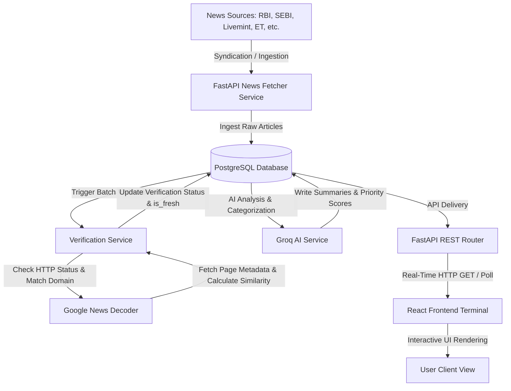

# MarketLens - Real-Time Financial Intelligence Terminal

MarketLens is a premium financial intelligence terminal and real-time news wire compliance tracker designed for modern investors, wealth advisors, and fund managers. It syndicates financial news, press releases, and regulatory updates from 11 distinct channels, utilizing an AI compliance verification engine to validate source links, check text similarity, and classify articles into core financial sectors.

---

## Architecture Diagram

The diagram below visualizes the data flow from ingestion through verification, AI processing, and delivery to the React frontend dashboard:



---

## Key Features

1. **Homepage Hero Story Selection:** Dynamically rotates and selects the most recent, verified, high-priority article (`priority_score DESC, published_date DESC, created_at DESC`).
2. **Strict Chronological Latest Wires:** Automatically sorts all syndicated news articles strictly by `published_date DESC` and falls back to `created_at DESC` to ensure perfect ordering.
3. **Live Breaking News Ticker:** Displays a scrolling ticker of developments from the last 24 hours (with auto-fallback to 48 hours if volume is low), updating dynamically every cycle.
4. **Weighted Freshness Prioritization:** Highlights verified, fresh articles (`verified = True` and `is_fresh = True`) at the top of category pages and regulatory alert boards.
5. **Real-Time Data Polling:** Refreshes stats, ingestion logs, and articles list every 30 seconds smoothly in the background without layout jumps or flickering.
6. **Active Telemetry & Stats:** Proves terminal activity with live metrics including a "Last Updated" relative timestamp indicator.
7. **AI-Powered natural language search:** Translates user search queries into structured database queries using Groq's LLM interface.

---

## Tech Stack

* **Backend:** FastAPI (Python), SQLAlchemy ORM, PostgreSQL (Supabase), Uvicorn server, Pydantic V2.
* **Frontend:** React, TypeScript, Vite, TailwindCSS / CSS variables, Lucide React icons.
* **AI & Parsing:** Groq (LLM processing), Google News Decoder, BeautifulSoup4, Feedparser.

---

## Environment Variables Required

Create a `.env` file inside the `backend/` directory:

```env
DATABASE_URL=postgresql://<username>:<password>@<host>:<port>/<dbname>
GEMINI_API_KEY=your_gemini_api_key_here
GROQ_API_KEY=your_groq_api_key_here
```

---

## Installation & Setup Steps

### 1. Prerequisites
Ensure you have Python 3.10+ and Node.js 18+ installed on your system.

### 2. Backend Setup
1. Navigate to the backend directory:
   ```bash
   cd backend
   ```
2. Create and activate a Python virtual environment:
   ```bash
   python -m venv venv
   # On Windows:
   venv\Scripts\activate
   # On macOS/Linux:
   source venv/bin/activate
   ```
3. Install dependencies:
   ```bash
   pip install -r requirements.txt
   ```
4. Start the FastAPI development server:
   ```bash
   uvicorn app.main:app --reload --host 127.0.0.1 --port 8000
   ```

### 3. Frontend Setup
1. Navigate to the frontend directory:
   ```bash
   cd ../frontend
   ```
2. Install node dependencies:
   ```bash
   npm install
   ```
3. Start the Vite development server:
   ```bash
   npm run dev -- --host 127.0.0.1 --port 5173
   ```
4. Open your browser and navigate to `http://127.0.0.1:5173`.

---

## Screen Captures

Below are illustrations showing the dynamic layout of the terminal features:

* **Hero Section & Latest Wires:** Displays high-priority verified alerts and dates grouped by relative badges.
* **Breaking News Ticker:** Auto-scrolling banner detailing live RSS feeds.
* **Feed Telemetry:** Online status breakdown table and connection details.

---

## Live Demo & Resources
* **Production Dashboard URL:** [MarketLens Live](http://127.0.0.1:5173/) *(Local Dev Server)*
* **API Documentation:** `http://127.0.0.1:8000/docs`
